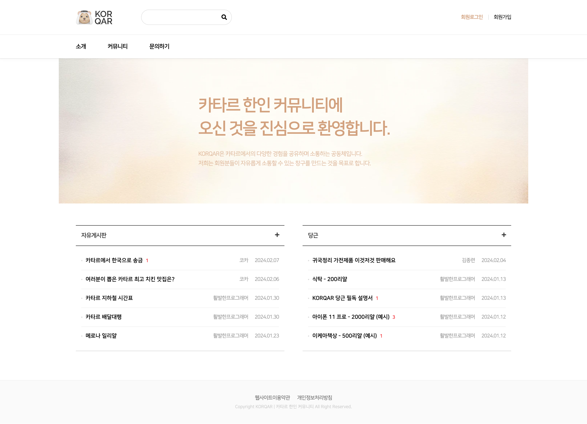

# KORQAR: Korean Community in Qatar

## Description

KORQAR is a dynamic platform tailored for the vibrant Korean community residing in Qatar. Developed using PHP, KORQAR serves as a hub for fostering connections, sharing valuable insights, and exchanging information among Koreans living in Qatar.

With KORQAR, users gain access to a comprehensive array of features designed to enhance their living experience in Qatar. Through intuitive boards and insightful discussions, members can share their experiences, seek advice, and stay updated on relevant news and events.

## Key Features

1. **Community Insight Boards**: Engage in meaningful discussions and exchange insights on various aspects of life in Qatar, including culture, cuisine, travel tips, and local events.
  
2. **Information Exchange**: Seamlessly share useful information, resources, and recommendations with fellow community members, enriching everyone's experience in Qatar.

3. **Event Announcements**: Stay informed about upcoming Korean community events, gatherings, and cultural activities happening in Qatar.

4. **User Profiles**: Create personalized profiles to connect with other members, build networks, and foster meaningful relationships within the community.

5. **Interactive Interface**: Enjoy a user-friendly interface designed for effortless navigation and seamless interaction, ensuring an engaging experience for all users.

## Acknowledgments

Special thanks to Yeon Geong Hwang for creating the digital illustrations of the website. Check out her [website](https://yeongeonghwang.com/) and [LinkedIn](https://www.linkedin.com/in/yeon-geong-hwang/)
